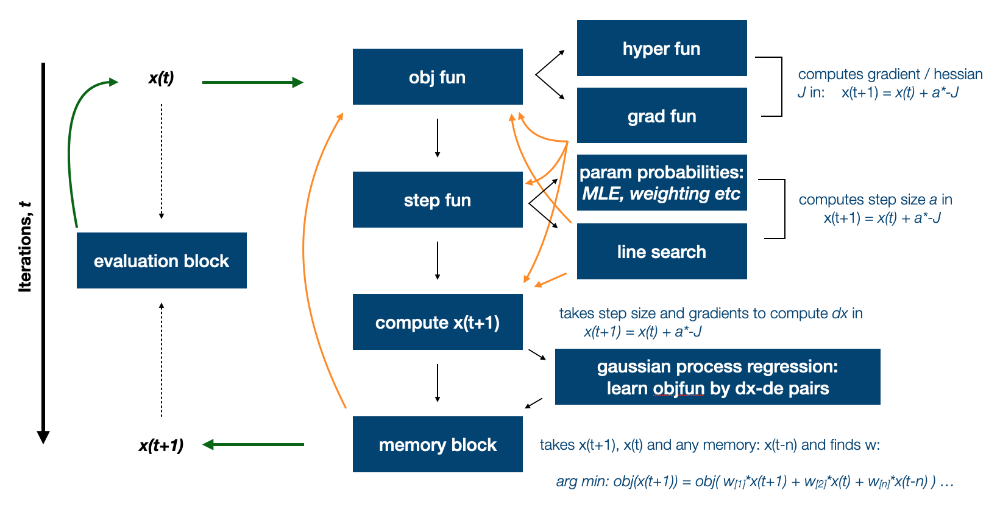
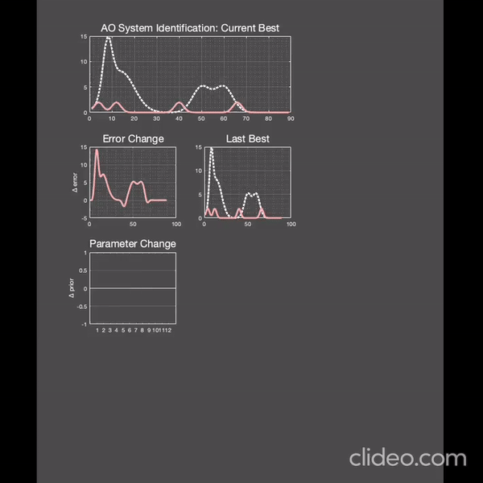

# aoptim

AO is an optimisation algorithm for parameter estimation of nonlinear dynamical and state-space models. 

It performs a 2nd order gradient (curvature) descent on a free-energy objective function using a sort of EM framework that incorporates MLE, line search, momentum acceleration and other options that implicitly try to minimise the error while maximising evidence and parameter probabilities. 

It is inspired by theoretical models of neuronal computation - i.e. the way the brain optimises its own 'parameters' to minimise its objective. In this sense, when applied to relevant problems, it is an AI.



```
Install:
addpath(genpath('~/Downloads/aoptim/'))
```

```
% Getting started with default options:

op = AO('options')

op.fun = func;          % function/model f(x0)
op.x0  = x0(:);      % start values: x0
op.y   = Y(:);       % data we're fitting (for computation of objective fun, e.g. e = Y - f(x)
op.V   = V(:);       % variance / step for each parameter, e.g. ones(length(x0),1)/8

op.objective='gauss'; % select smooth Gaussian error function

% run it:
[X,F,CV,~,Hi] = AO(op); 


% change objective to 'gaussmap' for MAP estimation
%
% By default the step in the descent is a vanilla GD, however you can
% flag the following in the input structure:
%
% op.isNewton       = 1; ... switch to Newton's method
% op.isQuasiNewton  = 1; ... switch to quasi-Newton
% op.isGaussNewton  = 1; ... switch to Gauss Newton
% op.isTrust        = 1; ... switch to a GN with trust region
%
```


See main AO.m 


Here's a video of the the optimiser solving a system of nonlinear differential equations that describe a mean-field neural mass model - fitting it's spectral output to some real data:



