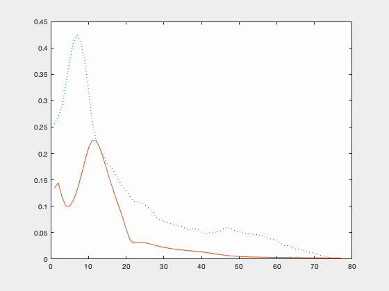

# aoptim
```
A curvature descent based optimisation routine for system identification.
Designed for highly parameterised non-linear MIMO/MISO dynamical models.


Fit differentiable models of the forms:

(1.)    Y0 = f(x0) + e   // model fitting, where truth, Y0, is known 
(2.)    e  = f(x0)       // generic function minimisation 


Usages:

Model fitting:

[X,F] = AO(fun,x0,V,[y],[maxit],[inner_loop],[Q],[crit],[min_df],[is_mimo],[ordr])

Generic function minimisation:

[X,F] = AO(fun,x0,V,[0],[maxit],[inner_loop],[Q],[crit],[min_df],[is_mimo],[ordr])


fun = function handle.
x0  = parameter start points - i.e. fun(x). Can be a vector if fun is a system.
V   = A step size/variance for each element of x0. If unsure, try 1/8ths.
y   = the real data to fit, when model fitting. If fun returns the error to be minimised, set to 0.
<br/>
maxit = (optional) max number of iterations, default 128.
inner_loop = (optional) max num iterations descending using same strategy.
Q = (optional) output precision matrix for MIMO systems, i.e. SSE = Q*(ey*ey')*Q';
crit = (optional) convergence crierion, default 1e-2.
min_df = (optional) minimum change in function value to continue, default 0.
is_mimo = (optional) system type flag: 0 = MISO (default), 1 = MIMO^. 
order = (optional) order of derivatives (see jaco.m), default 2 (curvature).

^MIMO = in Y0 = fun(x0), both x0 and Y0 are vectors. In this case, the derivative matrix is num-inputs-by-num-outputs, w.r.t error along Y0. 

Notes:

How well it works can be highly dependent on the step size / variances (V).
```

